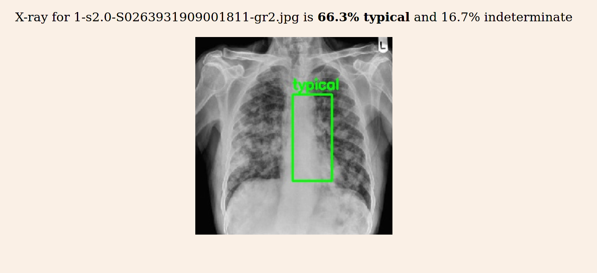

# Kaggle Covid-19 X-rays prediction

My notebook from the Kaggle competition https://www.kaggle.com/c/siim-covid19-detection 
where the goal was to detect Covid-19 pneumonia from the X-ray scan.

I used Keras models and Albumentations library to augment the images to level off and increase the dataset.

The model has been deployed to heroku at https://covid-19-xray-detection.herokuapp.com/

## Some examples of the predictions

### Negative example

### Typical example

